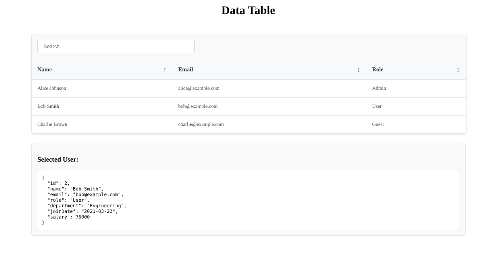

# Reusable Data Table Component

A fully-featured, type-safe Data Table component built with React and TypeScript.



## Features

- **Configurable Columns** - Define columns with type safety
- **Search/Filter** - Real-time text search with highlighting
- **Sorting** - Click column headers to sort (asc/desc)
- **Row Selection** - Single row selection with callbacks
- **Responsive Design** - Works on mobile and desktop
- **Custom Styling** - CSS Modules for styling
- **TypeScript Support** - Full type safety
- **Keyboard Navigation** - Accessible with proper ARIA attributes
- **Performance Optimized** - Efficient rendering with React hooks

## Prerequisites

- Node.js 18 or higher
- npm 

## Installation

1. Clone this repository:

```
git clone https://github.com/ranjanapatidar933-ship-it/-Reusable-Data-Table-Component.git
```

2. Install dependencies:

```
npm install
```

3. Start development server:

```
npm run dev
```

4. Open your browser to the localhost URL to see the demo.

## Usage

To use the DataTable component in your React application, you need to:

1. Import the component and its types
2. Define the data structure (TypeScript interface)
3. Configure columns with keys, labels, and options
4. Pass the data and columns as props
5. Optionally handle row selection and sorting

## API Reference

### Props

- `data`: Array of data objects to display
- `columns`: Array of column configurations
- `onRowSelect`: Callback function when a row is selected
- `defaultSort`: Initial sorting configuration
- `searchable`: Boolean to enable/disable search
- `className`: Additional CSS class
- `selectedRowId`: ID of pre-selected row
- `getRowId`: Custom function to extract row ID

### Column Configuration

Each column can have:

- `key`: Property key from the data object
- `label`: Display label for the header
- `render`: Custom render function (optional)
- `sortable`: Boolean to enable sorting
- `width`: Fixed width specification

## File Structure

```
src/
├── components/
│   └── DataTable/
│       ├── DataTable.tsx       # Main component
│       ├── DataTable.module.css # Styles
│       ├── types.ts           # TypeScript types
│       └── index.ts           # Exports
└── Demo/
    ├── DemoPage.tsx          # Demo component
    └── mockData.ts           # Sample data
```

## Styling

The component uses CSS Modules for styling, providing:

- Clean, modern design
- Responsive breakpoints for mobile
- Hover and selection states
- Customizable color scheme
- Accessible focus states

## Accessibility

- ARIA labels and roles
- Keyboard navigation support
- Screen reader compatible
- Semantic HTML structure

## Browser Support

- Chrome/Chromium 90+
- Firefox 88+
- Safari 14+
- Edge 90+

## Contributing

Contributions are welcome! Please follow these steps:

1. Fork the repository
2. Create a feature branch
3. Make your changes
4. Test thoroughly
5. Submit a pull request

## License

MIT License - feel free to use in your projects.

## Acknowledgments

- Built with React 19 and TypeScript
- Uses Vite for fast development
- CSS Modules for styling
- ESLint for code quality
